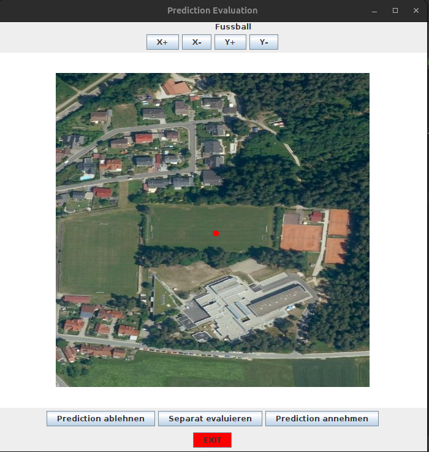

# Satelite Detection Control GUI

## How it works

1. Configure resource configs in src/main/resources and add correct paths
2. Build
3. Run Main

## Use it

### X+ : Move the center point to the right
### X- : Move the center point to the left
### Y+ : Move the center point up
### Y- : Move the center point down

